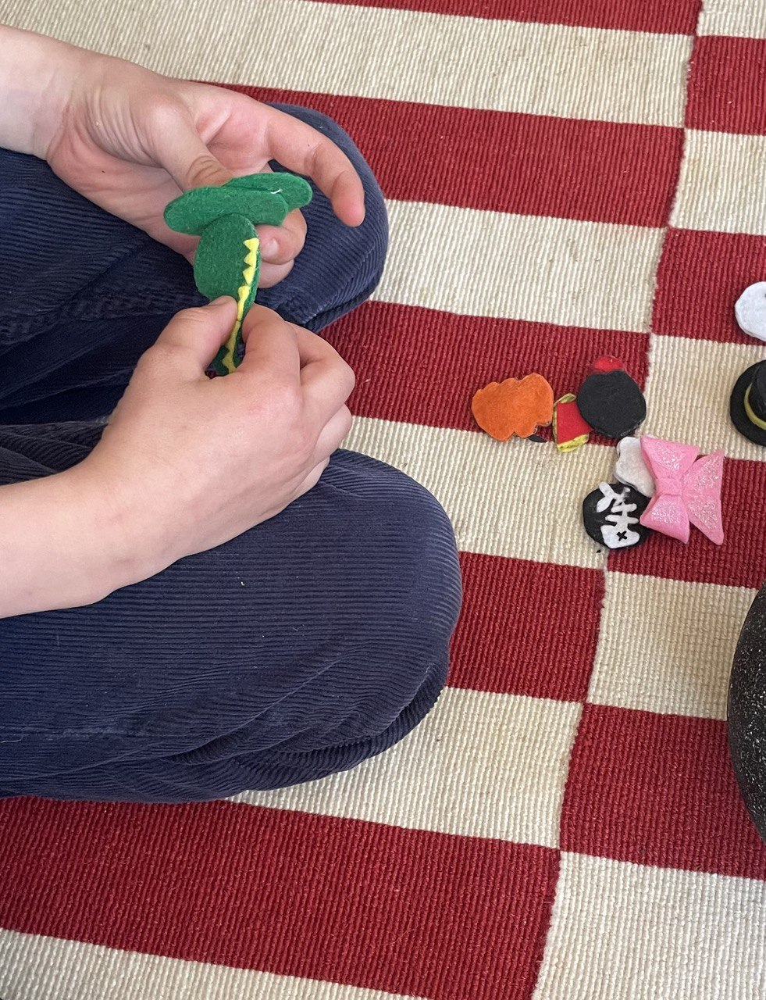

# Fairytale Cauldron
Featured by [MIT Morningside Academy for Design](https://www.instagram.com/p/DD4UAR2M043/?img_index=1)

## Project Description
**Fairytale Cauldron** is an AI-powered storytelling toy that tells you a fairytale inspired by the objects placed inside of it. 

Through the playful and physically interactive process of cooking up a personalized fairytale with the Cauldron, children and adults alike can explore the educational, creative, and moral implications of interfacing with large language models.

 

<video controls width="800">
  <source src="https://www.youtube.com/watch?v=nPA18yt5-14" type="video/mp4">
  Your browser does not support the video tag.
</video>

## Technology

Using Fairytale Cauldron, users add simple felted props such as a pink bow, cat paws, a jack-o'-lantern, or a skull, each containing an embedded RFID tag. The Cauldron, containing an RFID reader, senses data from the tags and prompts a large language model.

The project integrates Arduino hardware, node.js, p5.js, Web Speech API and OpenAI API.
 

## Design Process

### Precedent

#### Fairytales and Children Education
Fairytales play a significant role in children psychology. [According to PsychCentral](https://psychcentral.com/health/pros-and-cons-of-exposing-kids-to-fairytales), fairytales can "nurture a child’s imagination and teach them about real life." That is because these stories explore universal themes like justice, courage, and love, offering children a safe space to navigate emotions, conflict, and moral value

As Albert Einstein famously said, “If you want your children to be intelligent, read them fairytales. If you want them to be more intelligent, read them more fairytales.”

#### Design Inspiration

The design of the Fairytale Cauldron was influenced by the playful interactivity of make-it-yourself toys, emphasizing user engagement through tactile exploration. We also drew conceptual inspiration from the Grimm Brothers' *Sweet Porridge*, channeling its whimsical narrative and magical aesthetic into the cauldron's form and functionality.

 

### Object Design

#### Technical Drawing

#### First Iteration
Idea: Constructor where the goal is to assemble a fairytale character from available parts; AI will then create a fairytale about the character and read it

Issues:
- How will AI know which parts are selected?
- Limited keyword options: only things that can represent character traits or appearance - can we also customize other aspects of the fairytale, not just the main character?

#### Second Iteration 
Idea: The cauldron is a physical object that detects parts - plays an important role in storytelling. Keywords represented by thematic props can appear at any point in the fairytale; RFID reader with tags is used for “object recognition” due to its reliability

Issues:
- Limited area where RFID can read tags – how to design the props figures to fit the tags?

#### Third Iteration
Changes: 
- 3-4 flag tags can be read simultaneously - but the props need to be 2D
- Imagery of the props needs to be representative enough for kids but not too literal – leave room for imagination!
- A funnel part will ensure the tags are read while keeping the interaction natural
- Size needs to be big enough for a hand to fit inside

#### Final result
 
here should be jpg image

### Code Development
#### Prompt Engineering
 

#### Repo
Link

## User tests
In addition to congitive tests conducted in studio with TAs and other studetns, we tested the Fairytale Cauldron with stakeholders - children.

  <!-- Text Column -->
  

  

    From the user tests, we learned that children are very drawn to the props, way more than we expected. This means that not only would they enjoy the story, but also can act it out using the props, or come up with other play ideas.
  

  

  The interaction was natural, as expected. One thing to imrpove with the next iteration would be working on making the narrator's voice more personalised and playful as opposed to somewhat robotic tone that the API we chose offers. Additionally, due to limited hardware supply, we used a laptop speaker to narrate the story, but placing it inside the Cauldron would be better.
  

  

  <!-- Image Column -->
  

    
  

 

## Lessons learned
- Importance of designing from user’s point of view and testing
- Continuous adaptation
- Think what is under your control and what isn’t – embrace randomness
- Everything is about the story - who, what, where?
- Be playful

