# Replate

**RePlate** is a food-sharing app designed to **tackle food waste and food insecurity** by connecting those with surplus food directly to those in need, eliminating third-party involvement. By fostering a **culture of sustainability** and community-driven food sharing, RePlate encourages **meaningful exchanges** that benefit both individuals and the environment.
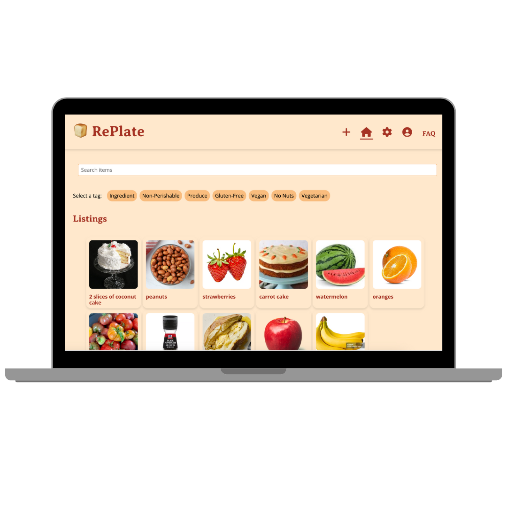

[video of the app]

## Background 
**Problem**: [Up to 40%](https://www.usda.gov/about-food/food-safety/food-loss-and-waste/food-waste-faqs) of food is wasted in the US, contributing to rising carbon emissions. At the same time, [13.5%](https://www.ers.usda.gov/data-products/ag-and-food-statistics-charting-the-essentials/food-security-and-nutrition-assistance/) of US households experience food insecuity. While there are efforts adressing this issue, the existing solutions often rely on third parties, missing the chance to build community ties and destigmatize food aid.

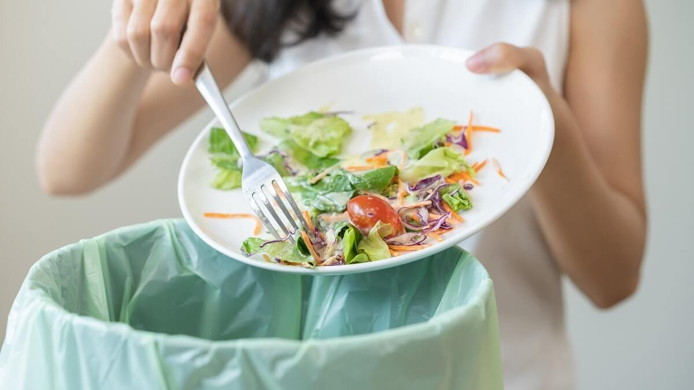

**Solution**: RePlate bridges this gap through a user-friendly platform for direct food exchanges. Users can list and request as well as claim and offer items. Features like expiration dates, reviewing, and reporting ensure safe, equitable, and positive interactions.  

**Impact**: RePlate caters to diverse users, from home cooks with excess meals to farmers with surplus produce. It fosters sustainability, reduces waste, and strengthens connections across communities. With measurable outcomes like active user counts, food exchanges, and user satisfaction, RePlate drives real-world change — one plate at a time.

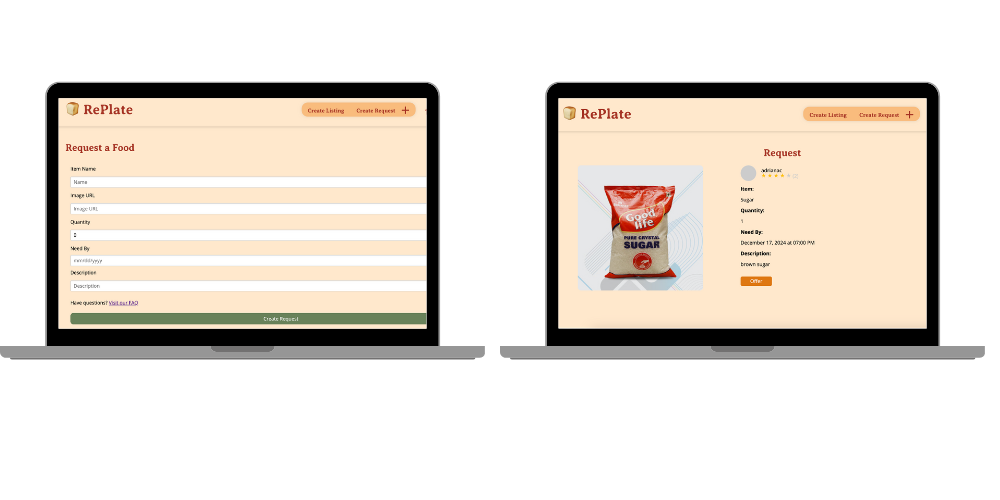

# Development Process

## Needfinding: User Interviews

We prepared a brief interview plan for each interviewee, conducted the interviews, and took detailed notes, focusing on their motivations, strengths, needs, and blind spots. Participants were asked to share their background, their satisfaction with current food resources, and insights tailored to their expertise or experience: experts discussed food surplus issues, community solutions, and app interest, while users shared challenges with food access, community food-sharing experiences, and attitudes toward an app for improving food access. Key lessons were summarized to identify gaps and opportunities for creating value.

### Experts

  
👩🏽‍🌾 Lisa

  A farmer based in Quetzaltenango, Guatemala, who grows a variety of vegetables and fruits. She markets some of her produce while keeping a portion for personal use.

  
👩🏻‍🔬 Sarah

  A student majoring in Environmental Studies at Wellesley College. She is an environmental planner intern as well as a sustainability and environmental advocate.

### Users

  
👵🏼 Sveta

  A 55-year-old housewife from rural Ukraine. She lives with her husband, while her children are away at college, and prepares most of their meals at home.

  
👨🏿‍🍳 Michael

  An MIT student living in a cook-yourself dormitory, also serving as the president of the cooking club.

### Interviews Analysis 
The four interviews we conducted reaffirmed the need for a food-sharing app. All of our interviewees shared that they have experienced the effects of the **unequal distribution** of food before – whether it was having too much food or not having enough. They have found ways to deal with it, yet often someends up in the trahs bin.

Many had **informal systems for sharing food** with friends, family, or neighbors. For example, Sarah is part of a campus organization called SCOOP that redistributes leftover food. Michael’s community has a counter where residents can place non-perishable ingredients to share. Sveta is part of a village group chat with 1000+ members, where people often post about food and produce that they are selling. However, these systems aren’t perfect. Sarah has found that her options are limited even with her network, in part because she has **dietary restrictions**. Michael complained that **fresh produce is rarely shared**. Sveta feels that it is **hard to find old listings**, as they are quickly buried under unrelated messages.

Additionally, some of our interviewees expressed **reservations about sharing food**. Sveta and Michael both mentioned that they would hesitate to accept food from a complete stranger due to **safety concerns**, and some are uncomfortable with asking for food because of the **stigma surrounding food security**.

After the interviews, we identified several opportunities to create value in our app. Some features that we would consider implementing are **allergy tags** to make the app inclusive of those with dietary restrictions. We would also like to find ways to destigmatize asking for help as much as possible, **create community**, and *foster friendships*. In order to create a sense of trust, we’d like to include a **reviewing system**. Also, to ensure safety, some **administrative actions** must be taken like content moderation and automatic deletion of expired items.

### Value Senstiive Design Analysis 
We used Value Sensitive Design (VSD) analysis to ensure our app aligns with the ethical and social values of its users and broader stakeholders. This approach, along with use testimonies, helped us identify and address potential harms, such as food safety risks or inequitable access, while also fostering positive outcomes like community building, trust, and sustainability.

- **Non-targeted Use**: Nefarious users may claim all the free food, leaving others without access and potentially wasting it themselves. Others might list spoiled or tampered food, risking harm to those who unknowingly claim it, or may be unaware that their listed food has expired.

- **Sustained Friendships**: Active app users with shared values (e.g., sustainability, cooking) can form connections, especially due to geographic proximity, fostering friendships both on and off the platform. The app should facilitate these connections.

- **Indirect Stakeholders**: Corner stores and delivery services may lose demand if the app fulfills certain needs internally, though these businesses serve broader purposes that the app cannot replace. Addtionally, over time, these businesses might also become app users.

- **Diverse Geographies**: Urban users can share surplus meals or event leftovers, while rural users, like farmers, can exchange surplus produce or goods, catering to a variety of community needs.

## Diverging: Brainstorming Features

### Scrapbook of comparables 
In the diverging phase, we "diverge" as much as possible and look at all existing solutions that we can draw inspiration from or identify potential gaps.

(Click to see the details)

  
🛒 Too Good To Go 

This design highlights the money users save and the CO2 emissions they prevent by purchasing leftover foods at the end of the day, reducing food waste. By offering this informational perspective, the app emphasizes the positive impact of users' actions and serves as a motivating incentive to participate.

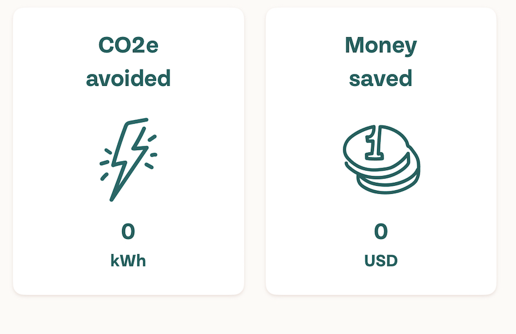{:width='400'}

  
🥘 Uber Eats 

The filtering system is highly intuitive and convenient — no typing required. With just one click, users can find exactly what they're looking for.

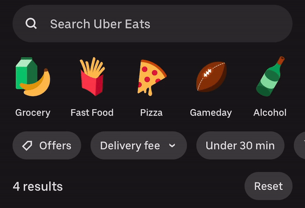{:width='400'}

Time estimation is very useful for busy people who are debating between ordering a single ingredient from a grocery store or asking neighbors.

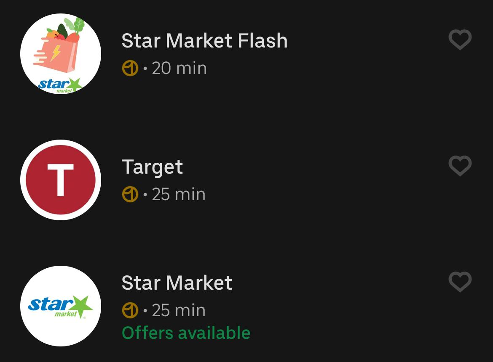{:width='400'}

The direct review system ensures quality and safety by allowing users to rate items upon receipt.
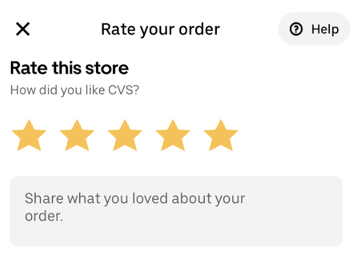{:width='200'}

  
👢 Depop 

Clicking on a user shows their shipping time — this could inspire similar stats for response time in our app.
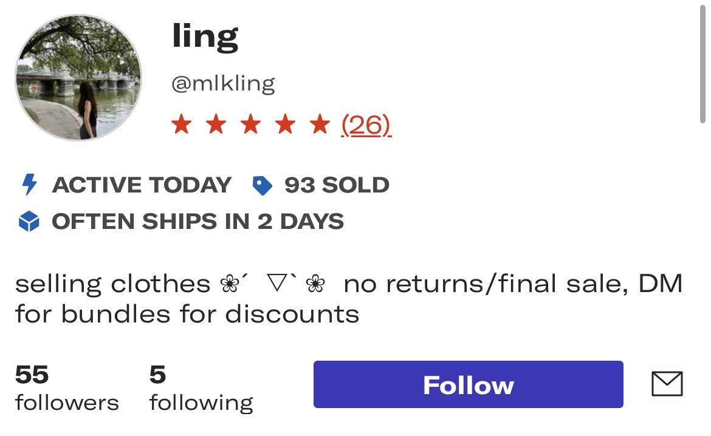{:width='400'}

The profile page shows all user’s posts, making it easier to buy multiple items from one seller and save time on trips.
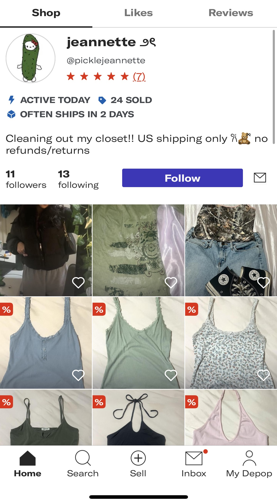{:width='200'}

Instructions on how to make photos and examples will be super helpful for users to make their listings more appealing.
{:width='200'}

  
🛍️ Facebook Marketplace 

Map view is nicely implemented: users can customize the local radius and only listings within that distance will be displayed.

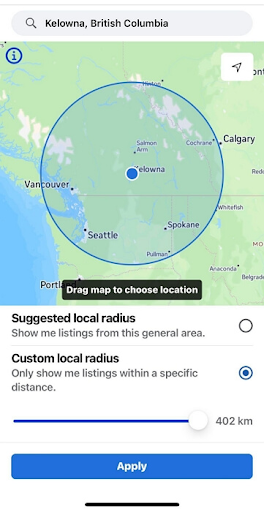{:width='200'}

  
🥕 Olio 

    
The app facilitates the sharing and selling of food and household items. While it focuses on minimizing waste, it lacks a request feature, which could be more relevant for the food insecurity issue.

A mapping feature similar to the one in Facebook Marketplace is present in Olio, but it also groups items by location.

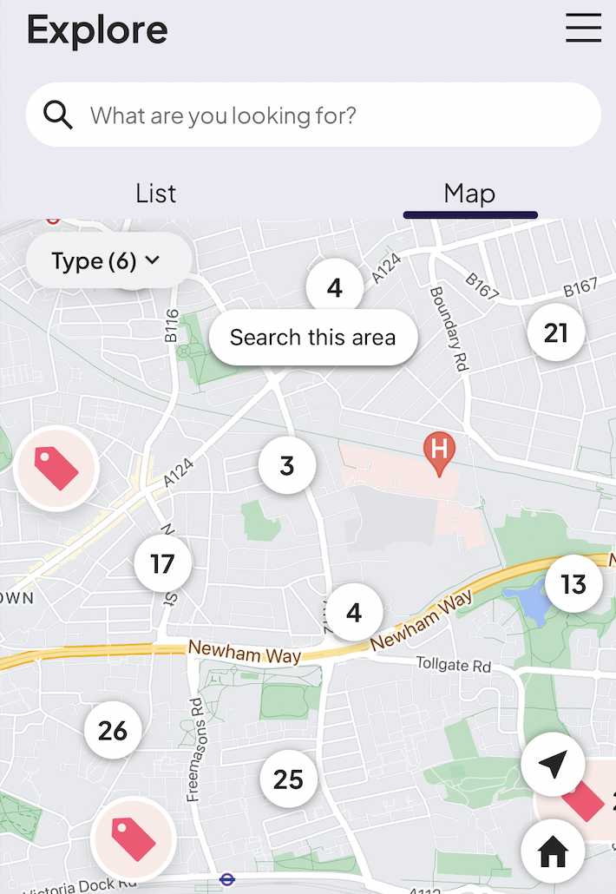{:width='200'}

Vu there is paywall to see listings - why?
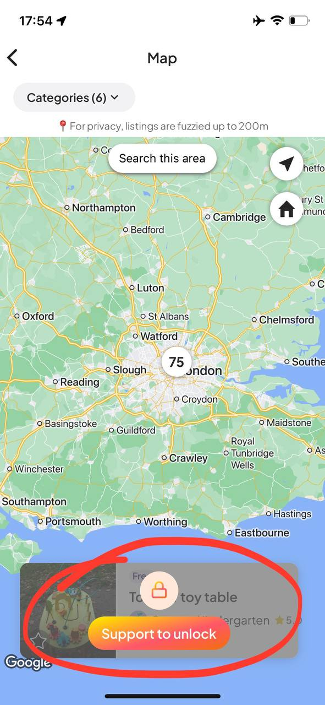{:width='200'}

Communities help build lasting friendships but shouldn’t be restricted like in Olio, where users must apply to join predefined groups instead of creating their own.
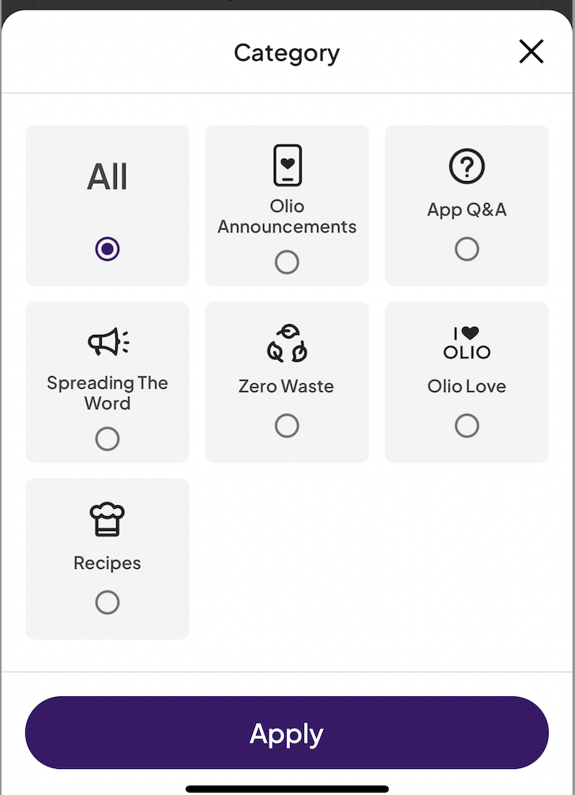{:width='200'}

  
👕 eBay 

Saved searches let users bookmark posts they want to revisit.

{:width='400'}

  
🦉 Duolingo 

Leaderboard is a way to to highlight user achievement and encourage them to keep going. We can implement a similar concept in the shape of badges or something like that.

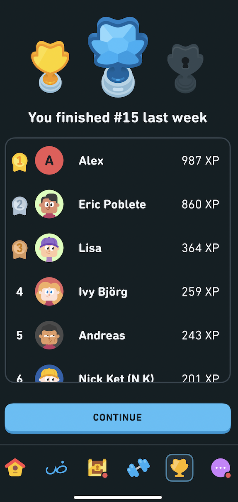{:width='200'} 

## Storyboards

### Wendy - wants to share surplus produce
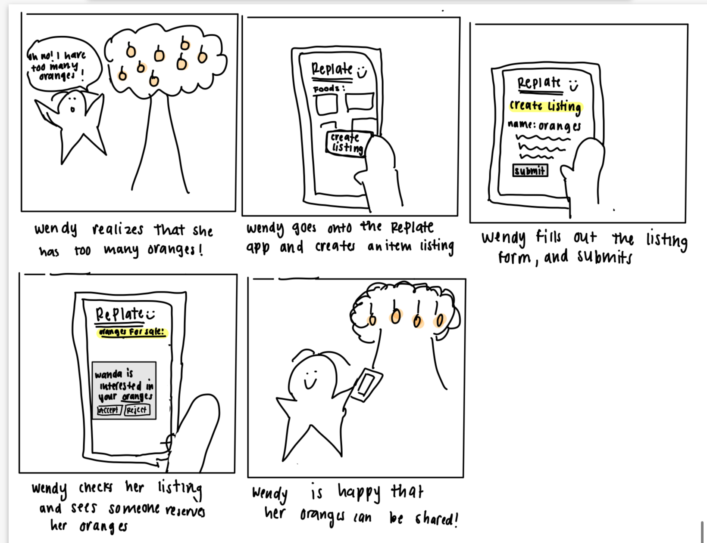{:width='500'}

### Wanda - needs produce
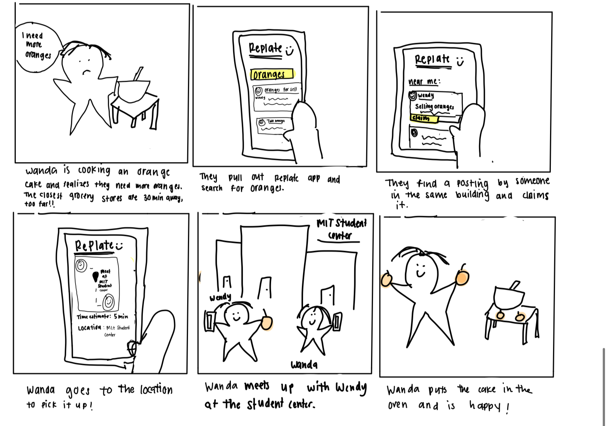{:width='500'}

## Converging: Defining the App
explanation 

  
Listing[Author]

  
  - **Purpose:** Users can share available items, specifying details to make them useful for others.

  - **Operational principle:** When a user posts a listing, it includes details like location, quantity, and an image, making it easier for others to understand its availability and suitability.

  - **State:**
    * listings: set Listing  
    * name: listings \-\> one string  
    * author: listings \-\> one Author
    * meetup\_location: listings \-\> one string  
    * image: listings \-\> one file  
    * description: listings \-\> opt string
    * quantity: listings \-\> one number
    * hidden: listings \-\> one Boolean

- **Actions:**
    * *add*( author: Author, name: string, quantity: integer,  meetup_location: string, img: file)   
        * adds a new listing containing an author, the name of the item, the quantity of the given item, the meetup location, and an associated image is added to listings; hide is set to false and remaining is set to quantity  
    * *delete*(listing: Listing)  
      * listing gets removed from listings  
    * *edit*(listing: Listing, name: string, quantity: integer, img: file)  
      * listing in listings is edited (either new name, quantity, or image)  
    * *getAllListings*()  
      * returns all items in listings  
    * *getListingsOfAuthor*(author: Author)  
      * returns all listings where author \== author  
    * *getRemainingQuantity*(listing: Listing)  
      * returns quantity of listing  
    * *updateRemainingQuantity*(subtract: number)  
      * update quanityt \= quantity \- subtract
      * if quantity == 0 set hide to true

			

  
Claiming [Item, Claimer]

  - **Purpose:** Allow users to reserve items by specifying the quantity they need.

  - **Operational principle:** Users can claim part or all of an item’s available quantity.

  - **State:** 

    * claims: set Claim  
    * claimer: claims \-\> one Claimer  
    * quantity: claims \-\> one number  
    * item: claims \-\> one Item  
- **Actions:**  
    * *claim*(claimer: Claimer, item: Item, quantity: number)  
      * a new claim is added to claims with the claimer, item name and quantity  
    * d*eleleAllClaimsOnItem*(item: Item)  
      * all claims where item \== item are removed from claims  
    * *unclaim*(claim: Claim)  
      * claim gets removed from claims  
    * *checkIfClaimed*(item: Item)   
      * returns true if item is in claims  

#### 

  
Requesting [Requester] 

- **Purpose:** Allow users to signal resource needs, enabling others to assist (by fulfilling requests).

- **Operational principle:** When a user requests an item, it becomes visible to other users. Requests can be hidden once fulfilled, ensuring visibility for only active needs.

- **State:** 
    * requests: set Request  
    * requester: requests \-\> one Requester
    * name: requests  \-\> one string
    * quantity: requests \-\> one number  
    * image: requests \-\> opt file  
    * description: requests \-\> opt string
    * hidden: listings \-\> one Boolean  

- **Actions:** 
    * *add*(author: Requester, Item: string, Qt: integer)  
        * a request is added to requests containing the requester, a given item, its quantity and (opt) its image  
        * hide is set to false  
    * *delete*(request: Request)  
        * request is removed from requests  
    * *edit*:(request: Request, Qt: integer)  
        * request’s quantity if updated to Qt  

  
Offering [Item, Offerer] 

- **Purpose:** Users can offer an item that another user needs.

- **Operational Principle:** if they offer the item needed, the user requesting the item can accept the offer.

- **State:**
    * offers: set Offer  
    * item: offers \-\> one Item
    * offerer: offers \-\> one Offerer  
    * imageUrl: offers \-\> one string
    * location: offers \-\> one string
    * message: offers \-\> one string
    * accepted: offers \-\> one Boolean  

- **Actions:** 
    * offer( offerer: Offerer, item: Item, img: string, location: string, optional message: string)  
      * offer containing offerer, item, img, location and  message is added to offers  
      * accepted is set to false  
    * accept(offer: Offer)   
      * offer’s accepted property is set to true  
    * editOffer(offer: Offer, opt img: file, opt message: string)  
      * offer’s image or message is set to new value  
    * removeOffer(offer: Offer)  
      * offer in the list of offers is removed   
    * removeOffersOfItem(item: Item)  
      * all offers whose item==item are removed from offers  

Expiring [Item] 

- **Purpose:** handle expiration of short-lived resources/items

- **Operational principle:** when an item is allocated an expiration date, it expires at that time

- **State:** 
    * active: set Item  
    * expiry: active \-\> one Date  
- **Actions:** 
    * **allocate**(rsc: Item, time: int)  
      * rsrc not in active  
      * active \+- rscr  
      * rsrc.expiry := time sec after now  
    * **editExpiration**(rsc, Item, time: int)  
    * system **expire**(out rsc: Item)  
      * rsrc is active: rsrc.expiry is before now  
      * active \-= rsrc: rsrc.expiry:=none  

Labeling [Item] 

- **Purpose:** Organize items under overlapping categories for easier retrieval and filtering.

- **Operational principle:** when a user lables an item, it can be retrieved with the given label

- **State:** 
    * labels: set Label  
    * name: labels \-\> one string  
    * labeledItems: labels \-\> set Item  

- **Actions:**
    * *create*(name: string)  
      * label is created and added to the list of labels  
    * *labelItem*(item: Item, label: Label)  
      * item is added to the in labels   
    * *getItemsWithLabel*(label: Label)  
      * finds label in labels, then returns labeledItems for that label  

Reviewing [Entity] 

- **Purpose:** Entities can review other entities

- **Operational principle:** after an entity gives a rating to another entity, it can be seen by other entities

- **State:**
    * reviews: set Review  
    * subject: reviews \-\> one Entity  
    * reviewer: reviews \-\> one Entity  
    * rating: reviews \-\> one integer  
    * message: reviews \-\> opt string

- **Actions:**  
    * *addReview*(subject: Entity, reviewer: Entity, rating: int, optional message: string)  
      * Add a Review to reviews with subject, reviewer, 1-5 rating, and message,   
    * *delete*(review: Review)  
      * Remove review from reviews  
    * *edit*(review: Review, optional text:string, optional rating: int)  
      * Find review in reviews and edit its text or rating  
    * *getAverageRating*(subject: Entity)  
      * find all of the reviews in reviews with subject as the subject, get their ratings, and calculate the average from these.  

Reporting [Entity] 
 

- **Purpose:** Enable entities to report misbehavior, enforce thresholds for flagging subjects as reported, and provide querying capabilities for moderation.

- **Operational principle:** When an entity is reported by at least two others, it is flagged as "reported" for moderation. Each entity can only report another once, and self-reporting is not allowed.

- **State:** 
    * reports: set Reports   
    * reporter: reports-\> one Entity  
    * subject: reports \-\> one Entity  
    * message: report \-\> opt string  

- **Actions:**   
    * *report*(reporter: Entity, subject: Entity)  
      * adds a new Report to reports, with reporter and subject. If getNumberOfReports(subject) \>= 2 and subject isn’t already in reported, add subject to reported.  
    * *checkIfUserReported*(subject: Entity)  
      * returns true if subject is in reported, false otherwise  
    * *getNumberOfReports*(subject: Entity)  
      * gets the Reports from reports where subject == subject and counts them
     * *getReportsOfSubject*(subject: Entity)  
      * gets the Reports from reports where subject == subject and returns them

