# Sisters Halaqa

Introducing Sisters Halaqa — an empowering digital space designed exclusively for Muslim women looking to build a strong community of sisterhood through seeking beneficial knowledge. Whether you’re a stay-at-home mom or any woman committed to learning, Sisters Halaqa offers a safe and supportive environment for growth.

Our app features tight-knit circles, where users can join based on their preferences and engage in meaningful discussions. From posting reflections and sharing Islamic insights to joining live discussion calls led by qualified teachers, circle members engage in active learning and connection. With features designed to align with Islamic values, including scheduling calls around prayer times and privacy considerations, Sisters Halaqa makes it easy to prioritize both religion and socializing.

More than just an app, Sisters Halaqa is a safe haven for Muslim women, offering a space to learn, connect, and thrive—all from the comfort of your home.

# Development Process
## **Needfinding**

How do I design an app that facilitates a safe and empowering environment for Muslim women to gather to gain beneficial knowledge and socialize? How to cater it to stay-at-home women?

### Motivation & Planning
Seeking religious knowledge is obligatory in Islam. Islam also encourages women to foster sisterhood that motivates and helps its members. After studying literature, I was surprised to learn that for many centuries, it was mosques that, in addition to being places of worship, served as social and educational hubs for women. However, nowadays, with globalization, emigration, pandemics, and other 21st-century factors, many Muslim women don’t have access to such gatherings. Thankfully, with the advent of the Internet and social media, Muslim women learned to utilize them to create virtual spaces for learning and socializing. Seeking knowledge became convinient and accessible. These, unfortunately, don’t come without caveats, often compromising safety and religious values. Instead, I wanted to explore ways to create a platform that is specifically designed for that demographic and their needs and concerns.

## User Interviews

Growing up in a secular environment with access to diverse learning resources, including religious spaces, I sought to understand perspectives from different walks of life. To do so, I prepared open-ended conversation prompts, such as exploring individuals’ religious backgrounds, social media usage, knowledge acquisition methods, and experiences with women-only Muslim gatherings. These prompts allowed interviewees to share insights freely, enabling follow-up with specific questions to uncover deeper perspectives.

  
Participant 1: Reyana (Click to see the details)

    
    <ul style=" line-height: 1.2;">
        <li> 20 y.o. </li>
        <li> dental school student </li>
        <li> from Muslim-majority town in Russia</li>
        <li> born into a practicing Muslim family</li>
    </ul>

Reyana's experience with both social media and in-person women-only Muslim gatherings proved to be filled with insights.

Reyana prefers Telegram to other social media apps like Instagram or VKontankte for both socializing and educational content. She highlighted how she finds it versatile and non-distracting in contrast with the addictive feed on the gram filled with often inappropriate music and images. She picks the channels and conversations she is interested in joining and sorts them into folders, which helps her keep everything organized – essential for a busy student like herself. Focus on written content and the chat feature facilitate a more intimate connection with other sisters and “actually feels like talking to real people”. After learning that Telegram is not common in the U.S., she exclaimed, “What do they use then?” On the downsides, she only mentioned ads. As a CS student, I found it really interesting how she has no privacy or security concerns, even when I hinted in that direction. Telegram has a reputation of lacking transparency and having many ‘shady’ practices, so I would avoid sharing personal information, especially with untrustworthy groups.

As for seeking Islamic knowledge, Reyana shares that she is “fortunate to live in a community with like-minded sisters.” She attends weekly gatherings held in the house of the imam’s wife while men leave for the Friday prayer. Reyana says being surrounded by righteous women makes it much easier to not only learn about Islam but also apply the lessons to life. However, Reyana is sad to admit, because the imam's family travels a lot, many gatherings are canceled. Also, many of her friends don’t have such a community within reach, so in both cases, virtual circles become a refuge. She herself is part of a few Telegram groups like that. As opposed to a more traditional online lecture format, these virtual women-only gatherings tend to be extremely interactive and expose her to a broader geographic and age diversity.

  
Participant 2: Nigina (Click to see the details)

    
    <ul style=" line-height: 1.2;">
        <li> 27 y.o. </li>
        <li> trained product manager but currently stay-at-home mom </li>
        <li> Uzbek American living in New Jersey</li>
        <li> ethnically Muslim but started practicing recently</li>
    </ul>

Nigina finds many applications for Instagram. She has a blog about immigration to the US, which became viral. She is aware that she could get yet larger following on Tiktok, but she didn’t find time to adapt to it since "it's more for Gen Z". In addition to business benefits, Nigina follows many educational content creators. For example, she learned how to take care of the baby solely from mom blogs. Interestingly, Instagram is also where she found Muslim female role models who inspired her to learn more about Islam and start practicing.

Still, I am concluding that the interactions she gets from Instagram are not very personal because Nigina yearns for deeper connections. She recalls her college years when it was way easier to make friends. In the mosque, for example, she does not meet people like herself “situation-wise, aspiration-wise”. I found this comment interesting compared to Reyana's statement about how she specifically enjoys the diverse backgrounds Islam brings together in gatherings. Clearly, there needs to be a way to accommodate both preferences.

When it comes to seeking knowledge, Nigina talks with excitement about a private online circle she recently joined. In it, Muslim women come together to read the Quran and talk about it. According to Nigina, there are very few of them and she was really lucky to get a spot. Indeed, there seems to be a barrier for many women to access such opportunities, especially when they aren't actively engaged in the community like Reyana. Many of the online circles are not advertised and remain exclusive.

### Design Opportunities

Following the conversations, I identified several **design opportunities**:
- Ability to search for and join thematic circles, with the option to provide preferences and get best matches
- For circle organizers, ability to customize the level of interaction with the audience
- Homepage where the user can see all her circles and the menu bar that divides circles into categories (e.g. Islamic knowledge, prefessional development, counseling)
- Feature that helps users plan their circle schedule around prayer times (Islamic lessons after dawn prayer)

## Story boards
Aisha

  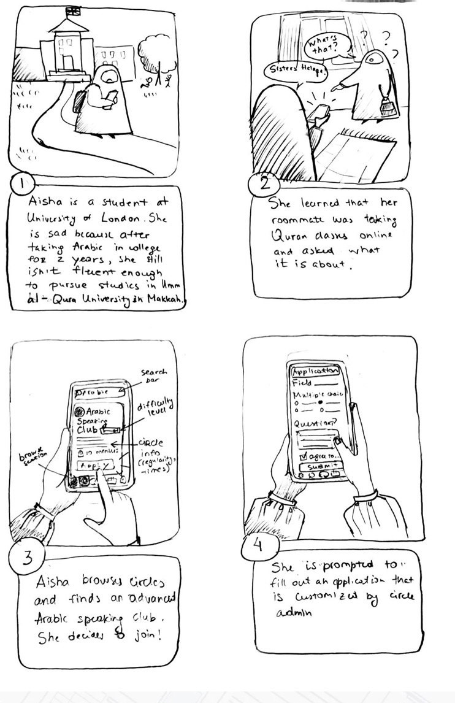
  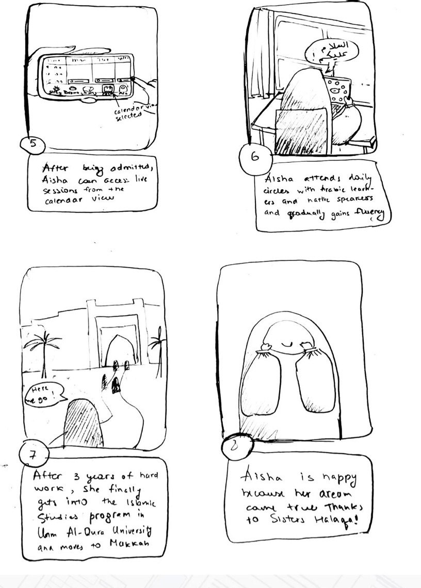

Amani
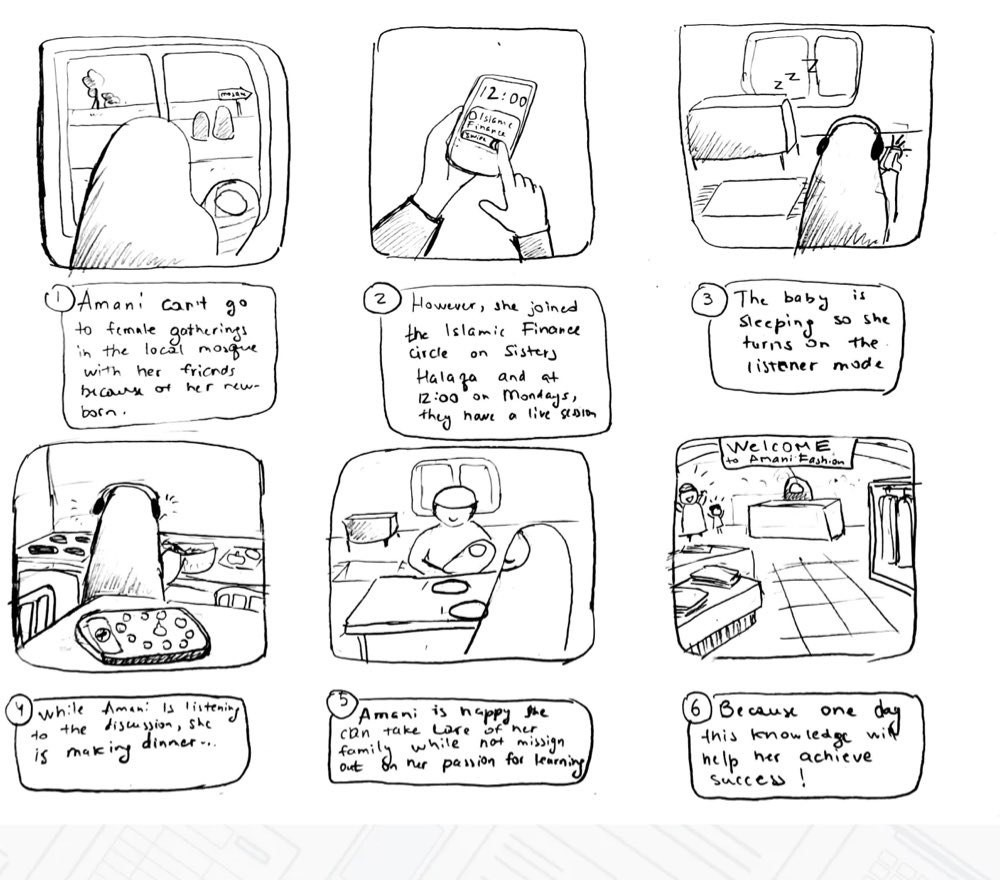{:width="500"}

Maryam
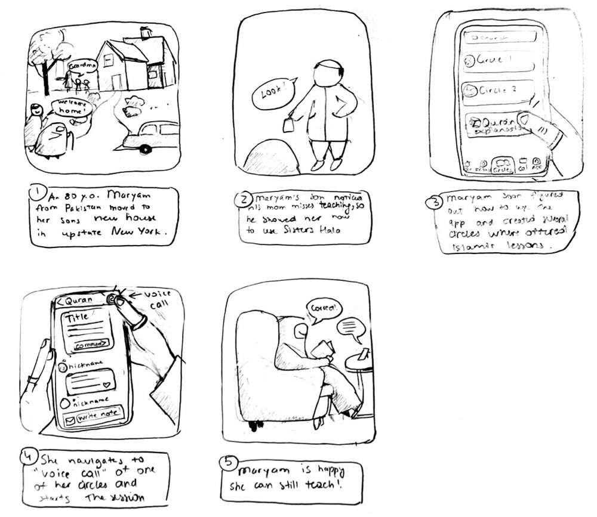{:width="500"}

## Diverging: Brainstorming

### Scrapbook of comparables
(Click to see the details)

  
Sheros 

Women-only social network with communities, counselling helpline, opportunities, resources and conversations developed in India.

Unfortunately, the mobile version is not available in the U.S., but I was able to test the web version. 

As soon as you sign up and log in, they ask for interests. After selection, the user is signed up for communities on that category without approval.  Good idea, but bad execution.
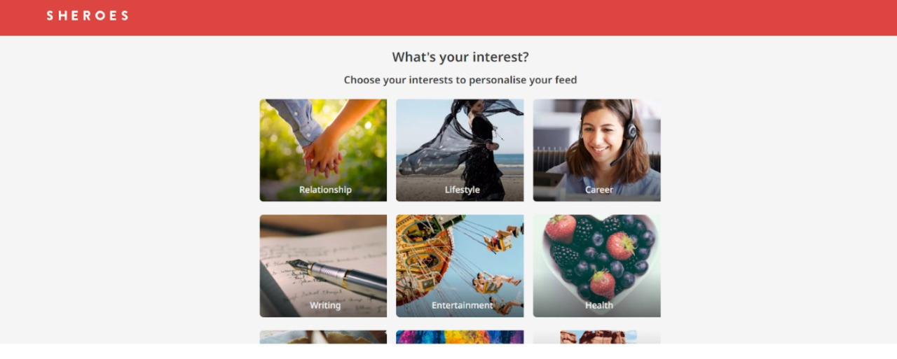{:width="400"}

There is a feed with posts from user's communities and people the user is following. I like the design; it is very recognizable, with top-performing posts on the top. However, scrolling this way can become a bit addictive, which does not align with the educational focus of Sisters Halaqa. So, I won’t be creating a feed with all posts and instead have posts sorted out into the communities/chats they belong to. 
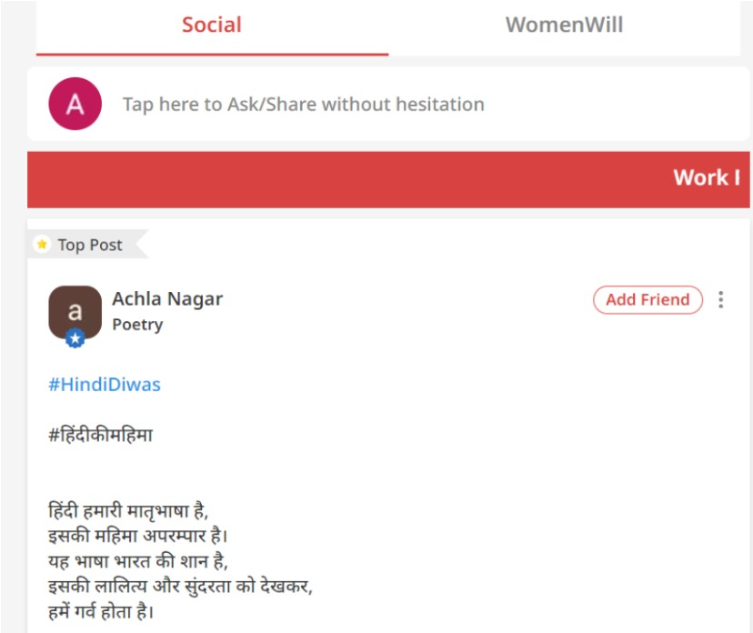{:width="400"}

I like the milestone feature (mine can have 'Newbie', 'Student of Knowledge', 'Scholar', etc.)
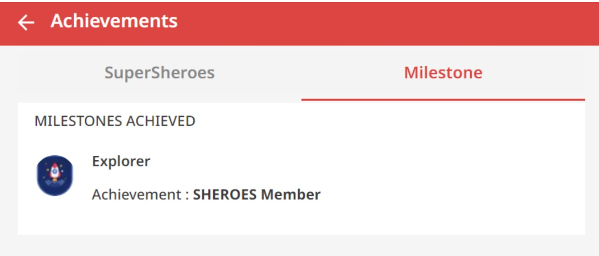{:width="400"}

  
Thrive Muslimah

 Thrive Muslimah positions itself as the first of its kind app in the world providing a support system for women that is line with Islam. The app also includes live lectures, courses, PDFs, and Ramadan Program. However, in order to get access to all this content, one needs to pay a monthly subscription.

 I like how the browse pages includes intro that describes the app’s missions and services. It is broken down into sections and easy to locate. There is also a search which is nice to narrow down the browse. Unfortunately, as a non paying user, I cannot see what the app looks like when logged as only subscribers can access that.
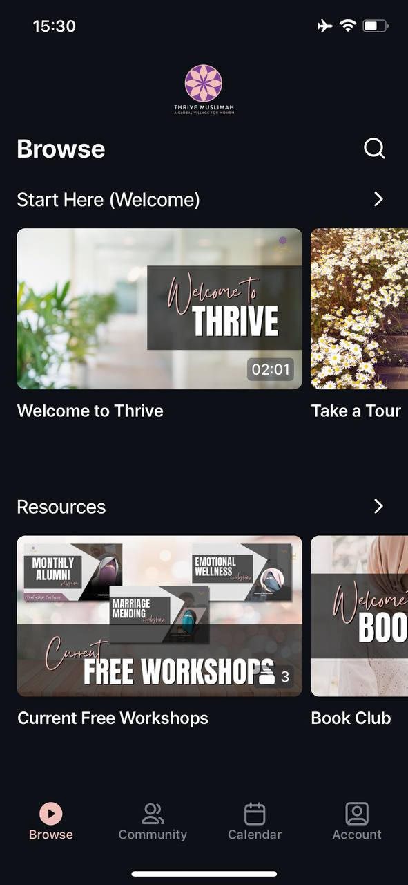{:width="200"}

Another feature that I like is the calendar view that shows all lectures and events.
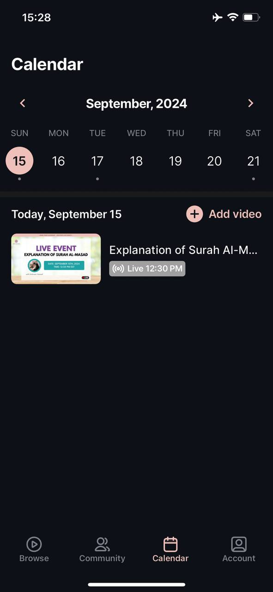{:width="200"}

  
Telegram & Whatsapp

One feature I’d really like to borrow from Telegram is the ability to sort chats into folders. On Telegram, though, you need to manually find this in settings, but for my app, I want to make it the default (sorted based on tags and can be edited manually).

{:width="300"}

I also like the new communities feature on Whatsapp. For example, an Arabic learning circle can have the main chat where lessons are held and assignments assigned but in addition to it a sub chat where memes or videos in Arabic are shared between members.
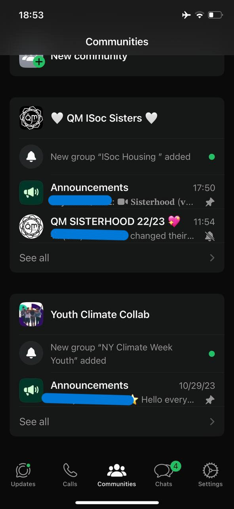{:width="200"}

### VSD Analysis
1. **Indirect Stakeholders**: Sisters Halaqa may indirectly affect in-person circle organizers by drawing some students online. However, the app complements, rather than replaces, in-person gatherings, focusing on women without access to such communities. Furthermore, in-person teachers could benefit from the app's features (e.g., group chats, scheduling) while hosting live circles offline. The app should support private or local-only access, increasing visibility for nearby gatherings.

2. **Non-target Use:** The app may be used for unintended purposes, such as private paid circles, which does not align with the mission. While symbolic fees for financial independence are acceptable, transparency is essential. Payment systems won’t be integrated, and Terms of Use will clarify users’ legal responsibilities while warning against fraud.

3. **Sustained Friendships:** Like colleges, the app fosters community learning but doesn’t prioritize 1-on-1 friendships. However, friendships can naturally form and extend outside the app. App features should allow private chats or joining circles with friends.

4. **Crossing National Boundaries:** Language barriers may arise due to the app’s verbal focus. Solutions may include multilingual support, text translation, subtitles for calls, and language-based filters to help users find circles in their preferred language, connecting expats to communities back home.

## Converging: Backend Design & Implementation
After the diverging phase where I identified opportunities and brainstormed features, I "converge" everything I found to the most important functionality to start with software development. To do that, I used the innovative [Concept Design](https://essenceofsoftware.com/tutorials/concept-basics/sw-as-concepts/) technique proposed by Daniel Jacskon in his [*The Essense of Software*](https://essenceofsoftware.com/). Essensially, it is a way to structure software functionality more effectively.

### App Concepts
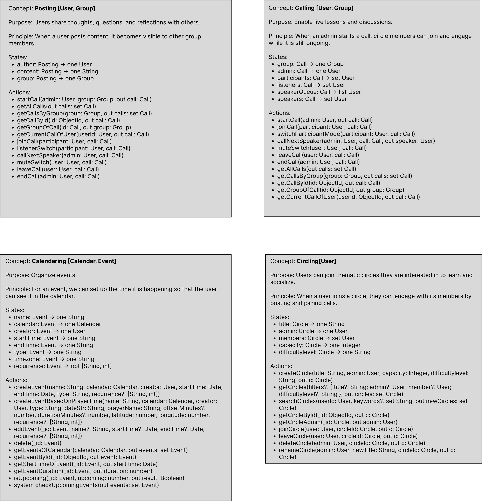

### Diagram

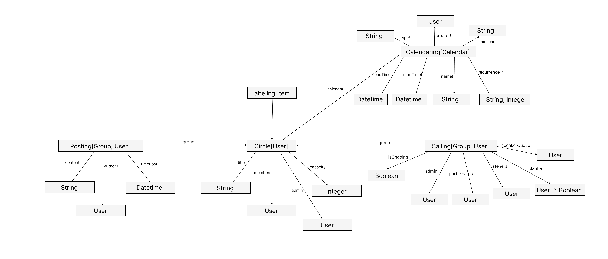

### Wireframes

[View my Figma flows here.](https://www.figma.com/design/vbzEO7jR57TANWgAtaN9E4/Untitled?node-id=4-5&t=pbDklZrqhn8kOXk9-1)

While these flows don't cover the entire app's functionality, they represent all key flows.

*Figma wireframes overview*

### Trade-offs and decisions
- **Simplified Circle Access with Capacity Limits:** Circles are free to join, simplifying the user experience and removing the need for an application process. Descriptions and difficulty levels help users choose suitable circles, while admins ensure alignment with group goals. Capacity limits foster engagement and minimize disruptions during lessons.

- **No In-Call Chatting**: To maintain focus during interactive lessons, chat features are excluded. Instead, users can post in the circle’s section for emergencies or reflections, ensuring discussions and shared media are accessible post-call.

- **Enhanced Privacy through Limited Profile Customization**: Profile personalization is omitted, aligning with the app’s focus on knowledge-sharing and community-building. This decision enhances privacy and eliminates self-presentation or follower-based interactions.

- **Simplified, Hijri-Focused Calendar**: A visual calendar integrates Islamic timings and religious events, replacing the Gregorian calendar with the Hijri calendar to reflect community preferences. Users view scheduled circle events without creating personal ones, emphasizing collective activities.

- **Borderless Circles with No Geographic Filters**: Geographic filters are excluded to encourage diverse, borderless connections. Time zone details can be inferred from circle descriptions, while secure third-party tools manage location-specific prayer times.

- **Dynamic Prayer Times via Adhan Library**: Static or locally stored prayer times were replaced with the ‘adhan’ library for real-time accuracy. This eliminates complexity and shifts the focus to real-time religious activities rather than static schedules.

- **Notification-Free Design**: Notifications were removed to reduce distractions during focused learning. Posts and calendar syncs ensure members stay informed about events, aligning with user feedback for a distraction-free experience.

- **Community Engagement with Leaderboard**: A leaderboard for posts encourages friendly competition, inspired by models like Duolingo. This fosters active participation within circles and sets the foundation for future features like badges.

- **Streamlined Calling Feature**: All participants, including listeners and active participants, are managed in a single array. This simplifies transitions during calls, enhancing the learning experience by reducing interruptions and confusion.

## Frontend Design

### Heuristic Evaluation

#### Usability Criteria
- **Discoverability:**
The interface uses standard icons for intuitive functionality and minimizes complexity for non-admin users. Visual cues and text descriptions aid older or less tech-savvy audiences.

- **Safety:**
Previous designs lacked confirmation prompts for critical actions (e.g., leaving a circle, ending calls, or deleting posts). To prevent mistakes like losing the last circle spot or disrupting calls, future iterations will include confirmation messages and require at least two clicks for such actions.

#### Physical Heuristics
- **Gestalt Principles:** The call view uses a circular layout to indicate a speaking queue, with grouped actions for clarity. The calendar view organizes events chronologically, using color to highlight recurring or similar events.
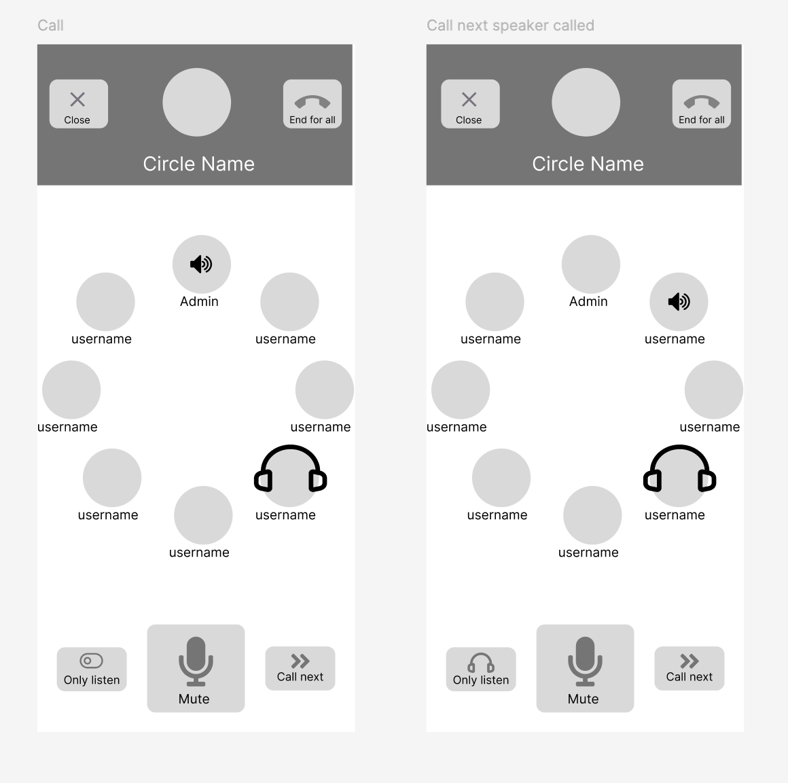{:width="400"} 

- **Situational Context:** Navigation uses a highlighted color for the active page and categories, ensuring users can easily identify their current context.

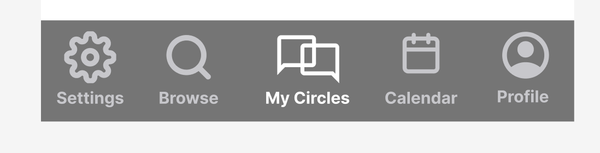{:width="400"}

- **Accelerators:** Setting event times based on prayer schedules streamlines event creation, especially recurring ones, and avoids conflicts with fluctuating prayer times.
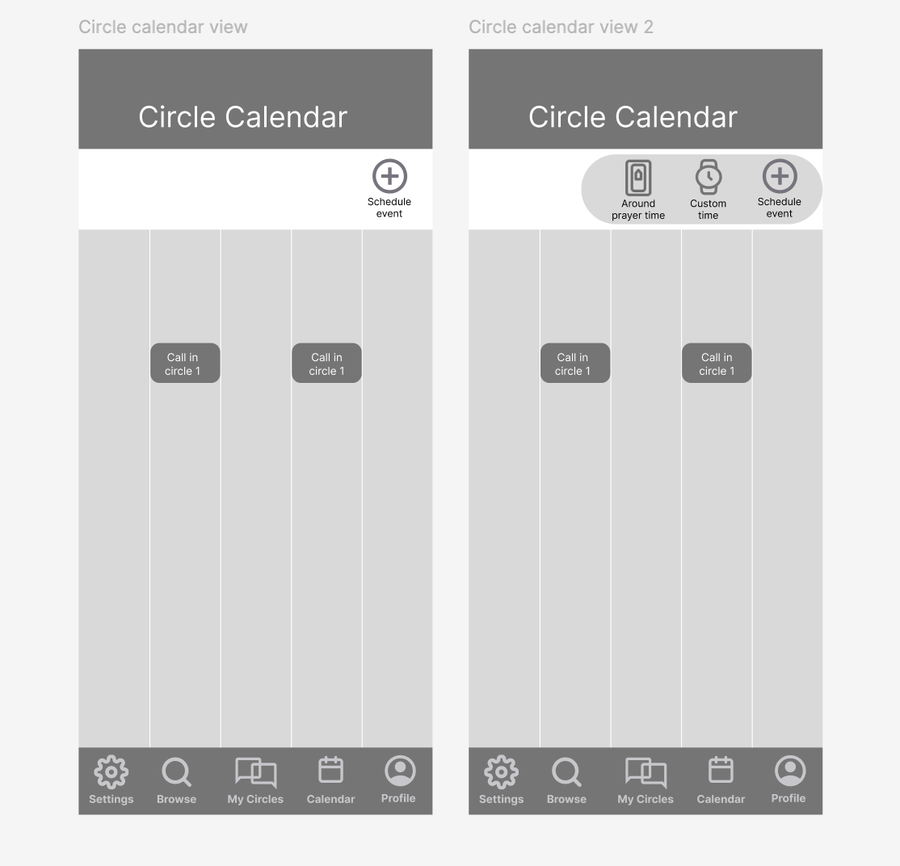{:width="400"}

#### Linguistic Level
- Consistency: "OK" always appears on the right, while "Cancel" or "Go Back" is on the left, maintaining uniformity across actions.

  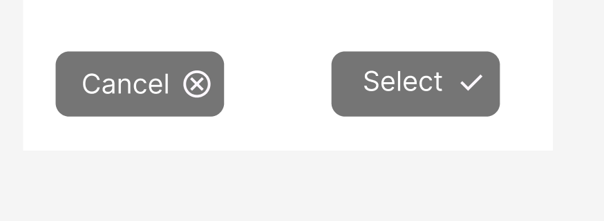
  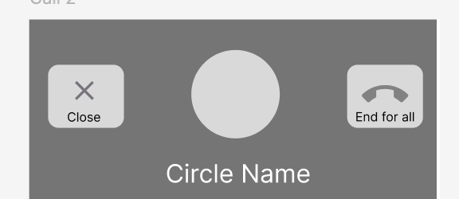

- **Information Scent:** To improve discoverability, the Browse view’s search bar will include autocomplete and dropdown options for circle categories, tags, and levels.

