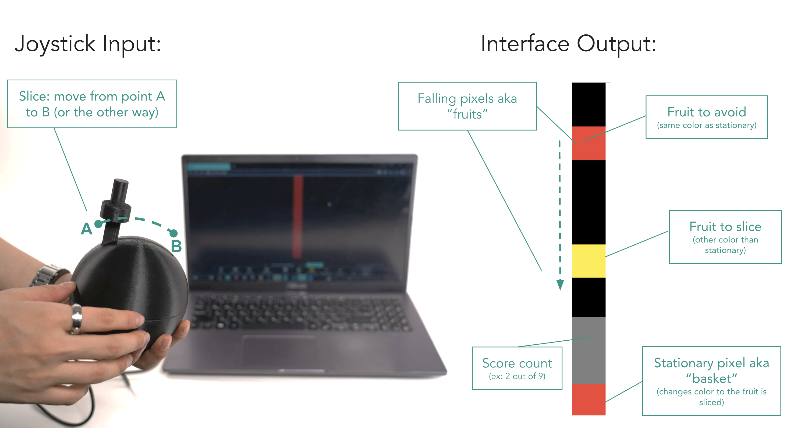
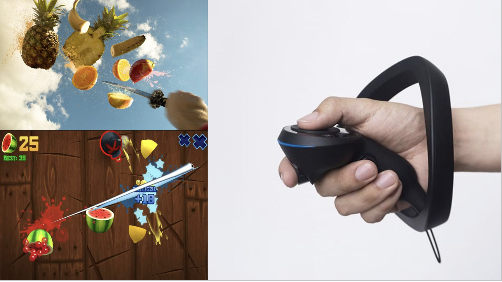
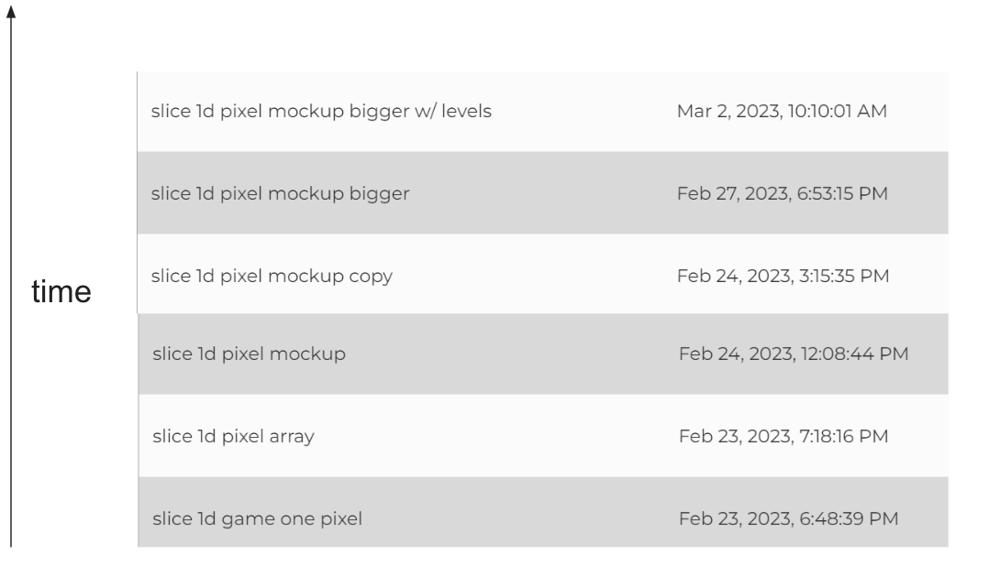
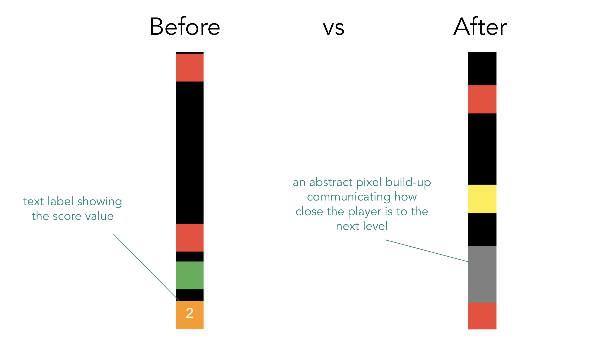
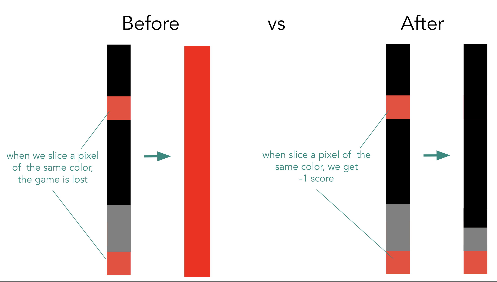
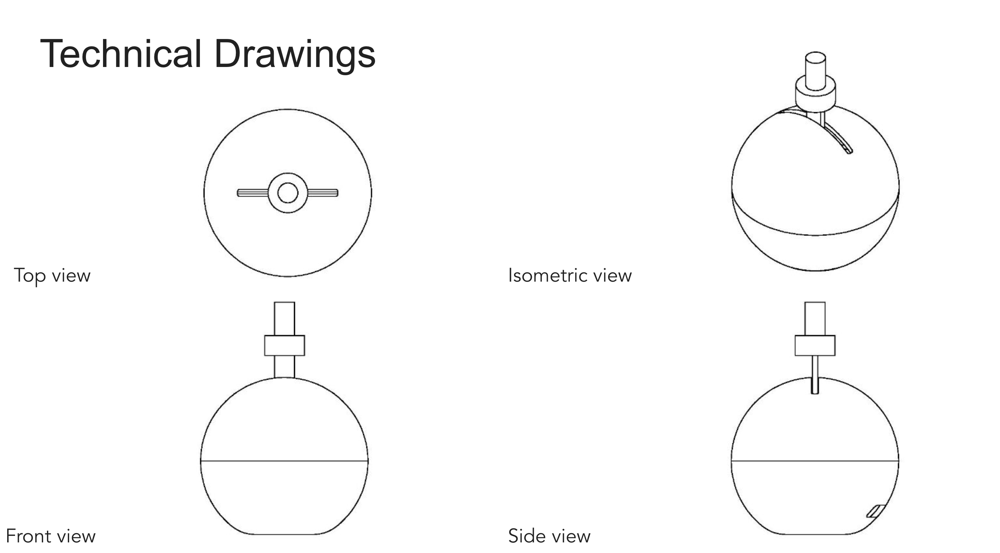

# Slice!

Slice! is a 1D reaction game where players swipe on the right pixels at the right time to earn points. 

Think Fruit Ninja but in 1D!

To deepen the immersive experience, the joystick mimics the satisfying motion of slicing through objects, creating a tactile connection between the player’s movement and the in-game action.

Video showcasing the game: 

<video controls width="600">
  <source src="./videos/interaction.mp4" type="video/mp4">
  Your browser does not support the video tag.
</video>

## Design Process

### Precedent
We drew inspiration from the beloved classic, Fruit Ninja, celebrated for its immersive experience back in the day. Our aim was to recreate that excitement but in the physical world while maximally simplifying the digital interface, allowing the mind to fill in the gaps through non-visual cues like touch and sound.

### Software

We used p5.js, a powerful JavaScript library, to program our game from the ground up. Starting with a simple foundation of falling pixels and detecting "slices", we gradually expanded its functionality. Initially, our focus was on creating a responsive 1D game environment where interactions felt intuitive and precise. As we progressed, we added more layers of detail, such as animations, sound effects, and difficulty variables to enrich the player’s experience. Through iterative development, we fine-tuned the interactions to ensure seamless gameplay, enhancing both the visual and sensory elements to create an engaging and immersive reaction-based game.

#### Some game design decisions we made

### Hardware

## Lessons Learned
- Focus on the behavior and leave room for imagination
- Every element serves a purpose – remove/modify if doesn’t add any meaning or functionality
- Start with the simplest version and build on top of it, step by step
- Embrace spontaneity!
- Listen to people’s feedback – the game should be intuitive for everyone
- Test, iterate, test, iterate, and test over and over
