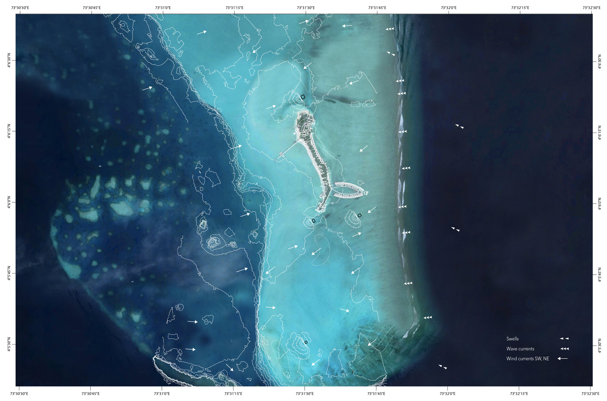
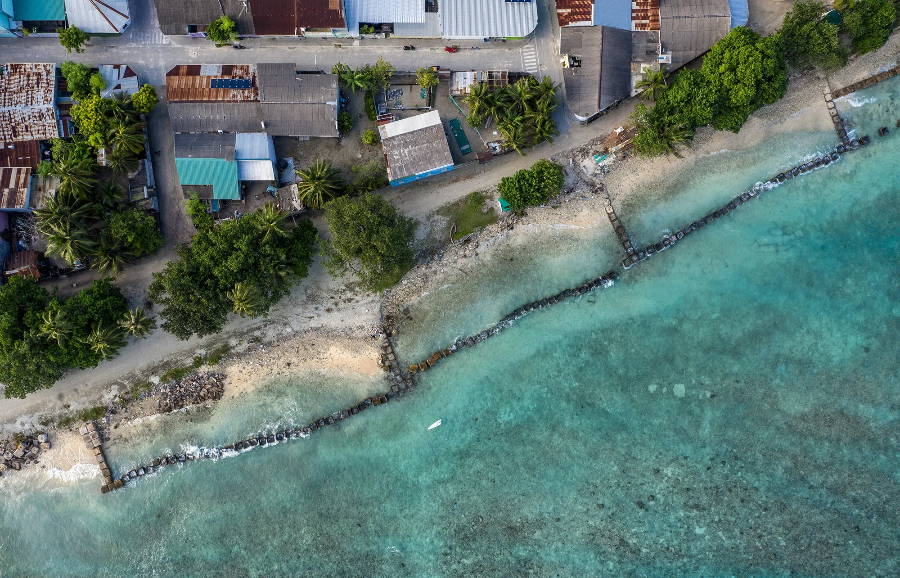
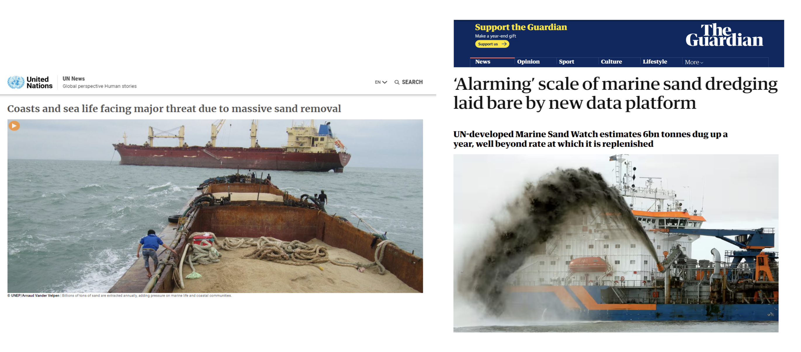
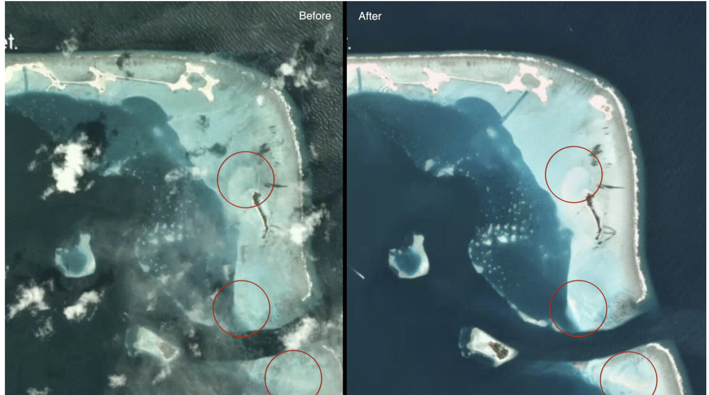
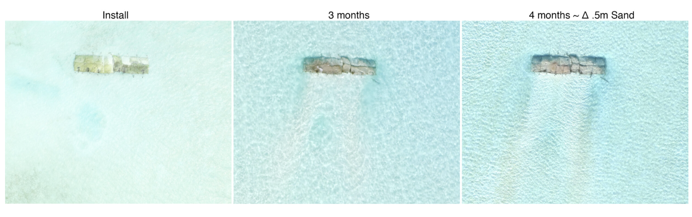
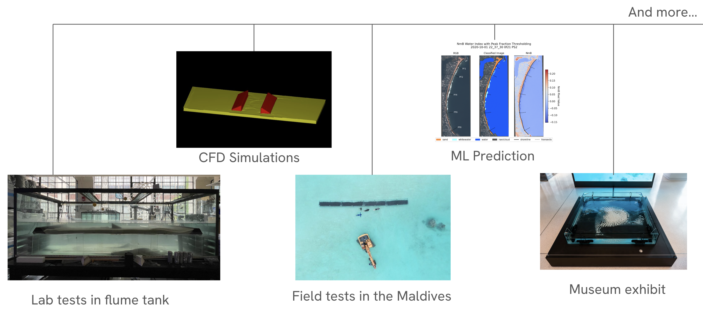
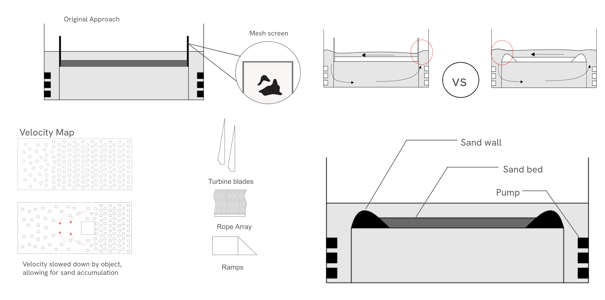
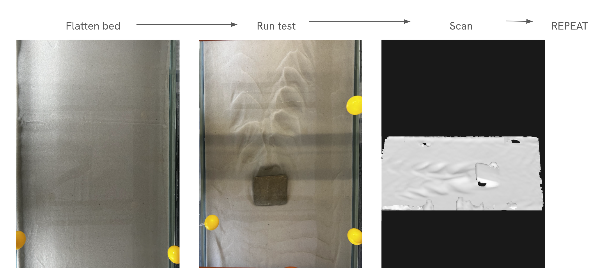
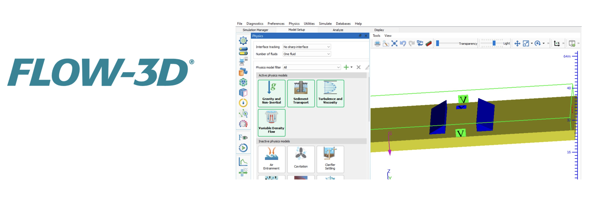
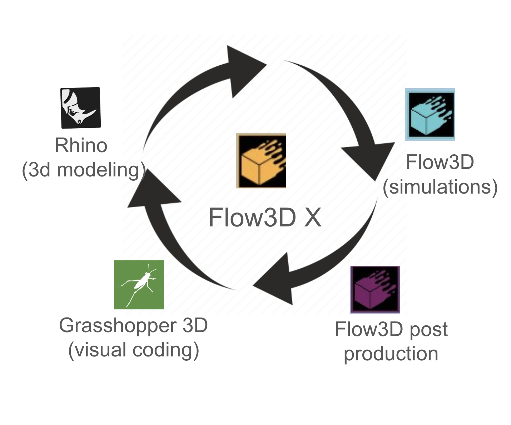

# Growing Islands 
An ongoing research endevour at [MIT Self-Assembly Lab](https://selfassemblylab.mit.edu/) striving to create a system of underwater structures that use wave energy to promote sand accumulation to protect local communities from rising sea levels.

## Understanding the Context

### Rising Sea Levels and Increased Risk for Island Nations

According to the Intergovernmental Panel on Climate Change, the global sea level is expected to rise between 0.43 m and 0.84 m by 2100 - even best case scenario requires adaptation. 80%+ of the Maldives islands lie <1m above the sea level, making them extremely vulnerable to the global sea rise. 

### Current Solutions

Sand dredging and concrete barriers, currently practiced solutions, are short term . In the rate the sea is rising, these approaches are simply unsustainable as they are trying to fight the forces of nature.

Moreover, sand pumping is hurting the coral reefs, vital elements of the local ecosystem. 

## Inspiration from nature

On the other hand, there are natural processes that result in native sandbar formation.

This satellite imagery shows sandbar formation that happened over just a few months. 

Studying these processes led the Self-Assembly Lab to propose a different approach to climate resilience.

## Solution: Harness Nature

**Growing Islands** is an endeavor to design geometries that harness the kinetic energy of water currents and waves to accumulate sand in strategic locations.

### Early research

Here are some results from the early days of the research showing sand accumulation over just a few months.

### Subprojects

Since then, the lab has branched into many subprojects.

## Project 1: Pipeline for Testing Underwater Geometries for Sand Accumulation

### Redesigning the flume tank

**Original setup:** The flume tank is a 3 by 6 ft water tank with an elevated sand bed. The pumps installed on opposite sides of the tank create a flow of water starting at one end, flowing below the sand bed till the other side, then up and across on the sand bed. This immitates the flow of water near shorelines. This way, by placing objects in the middle of the sand bed, we can see sand accumulation due to velocity changes created by the object.

**Problem:** To prevent the sand from flowing over the sand bed, we have a mesh screen. However, we discovered that over time the mesh gets clogged, which disrupts the water flow. After testing several options, we went with the sand wall which doesn't interfere with the flow while keeping sand in the bed. This also allows for an easier switch between flow directions, which previously required removing one of the screens.

**Result:** bidirectional, optimized water flow in the flume tank.

### Repeatability test
Once that was done, we worked on developing the workflow to test and document how various geometries perform with regard to sand accumulation.

We first flatter the sand bed, scan it. We then place the object we want to test, run the pumps for needed time period, after which we scan the sand bed again. We use the two scans to measure the accumulation. 

Not only is this workflow useful to compare geometries, but it can also be used on the same object to test repeatability and make sure we are manipulating correct variables.

### Computational Simulations
Since not all experiments can be set up in person, we decided to leverage available software tools to design computational simulations. Other advantages include scalability and more consistent and measurable results. However, computations have high runtime, so we spent a lot of time simplifying the variables to the most important ones to include them in the computation. We relied on the flume tank to validate the simulations.

### Automation
This allowed us to streamline the process by using Flow 3D X, which integrates different programs. We start by providing parameters we wish to optimize using Grasshopper, which then produces geometries in Rhino and tests them in Flow3D. The simulation results are processed in Flow 3D post production.
{:width="300"}

## Project 2: Using ML for Predictive Coastal Monitoring

While researching sand accumulation in the Maldives, Self-Assembly Lab collected a lot of information about the changes that are happening in the coastline. This inspired some researchers to use the data with state-of-the-art ML models to contribute to the field of predictive coastline monitoring.

We propose a study that evaluates the performance of three image segmentation models: 
- the Segment Anything Model (SAM) by Meta
- Prithvi by NASA and IBM
- YOLOv10 by Tsinghua University